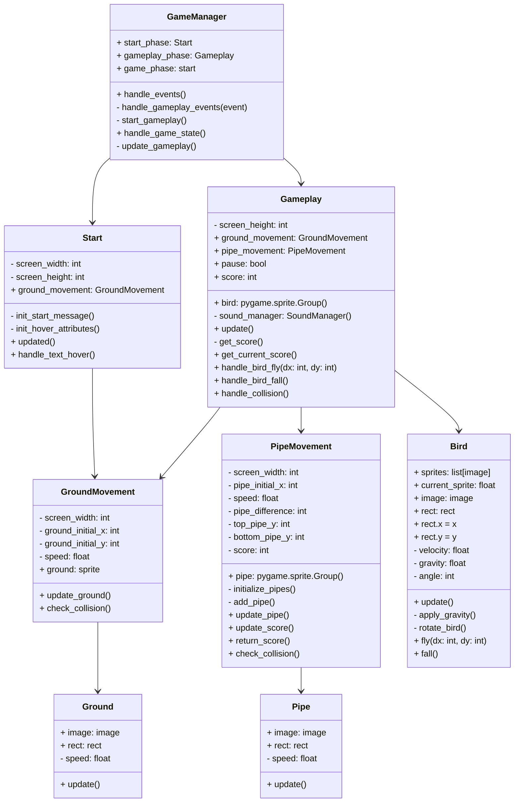

# Arkkitehtuurikuvaus

## Flappy Bird, alustava luokkakaavio

## Huomioita

Luokkakaavio on alustava hahmotelma ja se tulee vielä muuttumaan tarkemmaksi pelin edistyessä ja projektin rakenteen muuttuessa.
