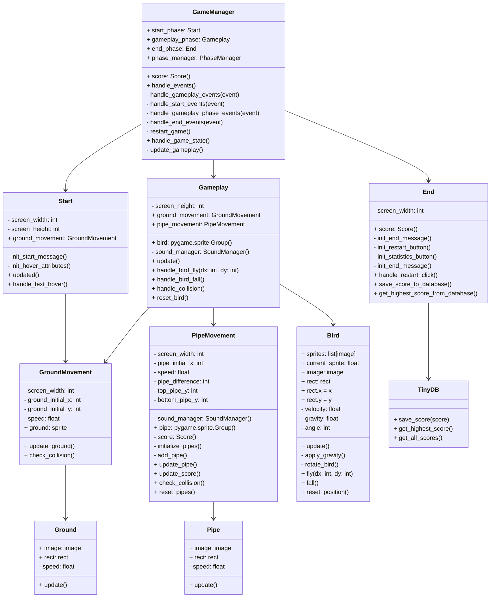
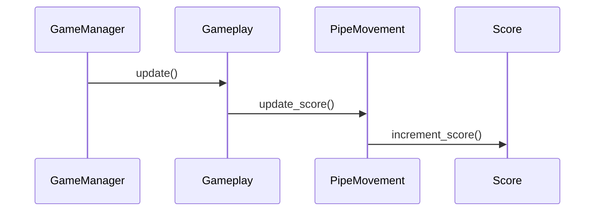

# Arkkitehtuurikuvaus

## Flappy Bird, alustava luokkakaavio

## Flappy Bird, Sekvenssikaaviot

### Pistemäärän päivittymisen logiikka

Luokka `Gamemanager` kutsuu `Gameplay`-luokan metodia `update`, joka sisällään kutsuu `PipeMovement`-luokan metodia `update_score`. Metodi käy läpi jokaisen putken sprite-objektin
ja jos putken vasemman reunan koordinaatti on yhtä suuri kuin linnun x-koordinaatti, se kutsuu `Score`-luokan metodia `increment_score`, joka lisää yhden pisteen kokonaispistemäärään. 

Pistemäärän päivittymisessä on tärkeää huomioida se, että pistemäärä päivittyy putkien liikkeeseen perustuen, eikä varsinaisesti liity lintuun vaikka se tältä vaikuttaakin.
Itse lintu ei pelissä liiku; sen x-koordinaatti pysyy vakiona. Liikkuvalla maalla ja putkilla luodaan illuusio ikään kuin lintu liikkuisi eteenpäin.

## Huomioita

Luokkakaavio on alustava hahmotelma ja se tulee vielä muuttumaan tarkemmaksi pelin edistyessä ja projektin rakenteen muuttuessa.
