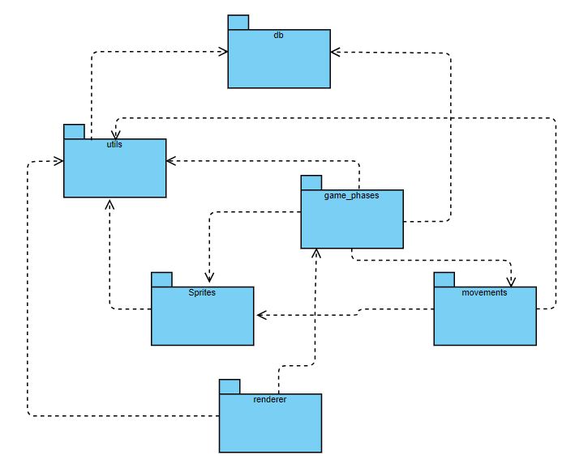
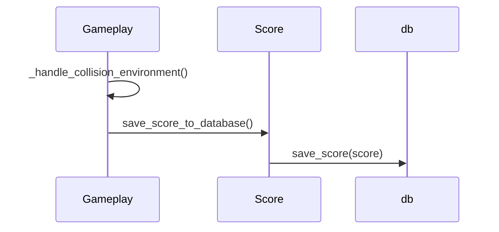
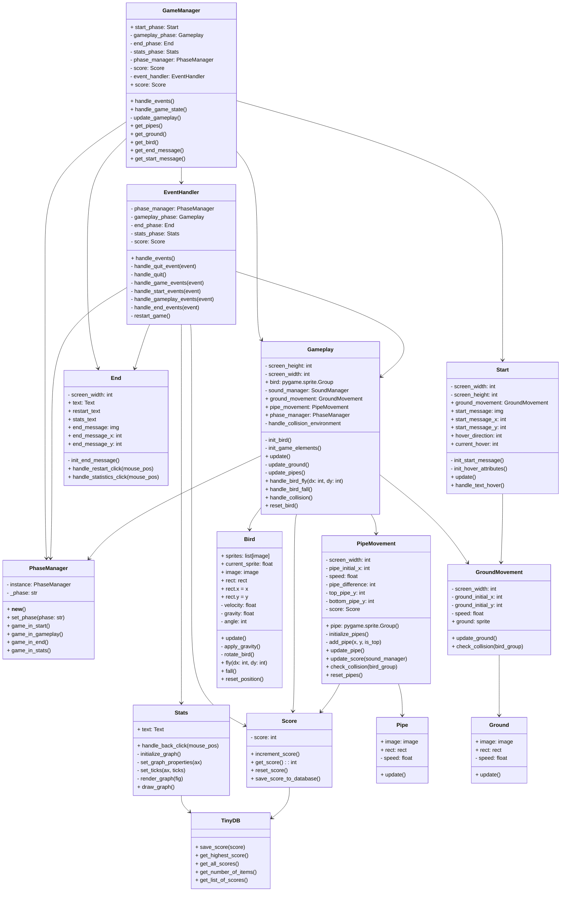
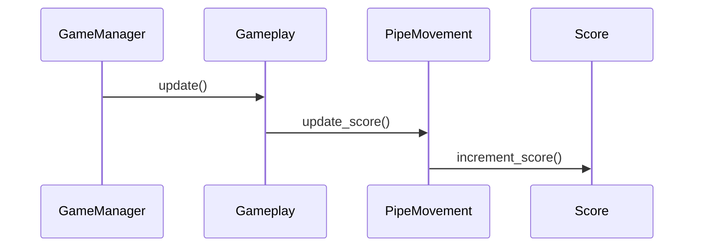
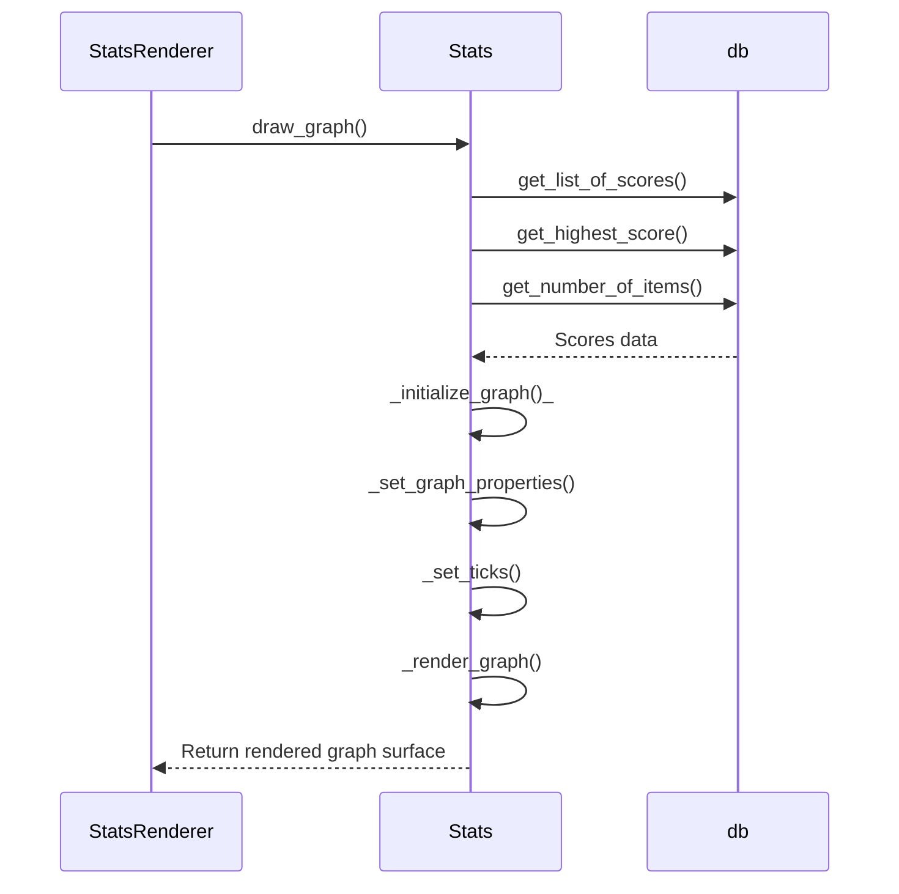

# Arkkitehtuurikuvaus

## Rakenne

Ohjelman yleinen rakenne käy ilmi alla olevasta pakkauskaaviosta:

Huomaa, että pakkauskaaviosta puuttuu sovelluksen kannalta keskeiset luokat, kuten `EventHandler` ja `GameManager`. Tarkemman kuvauksen pelilogiikasta löydät alempaa dokumentista.

## Pisteiden tallennus tietokantaan

Pelin pisteiden pysyväistallennuspaikkana käytetään `TinyDB` tietokantaa. Kun lintu törmää __maahan__ tai __putkiin__, kutsuu `Gameplay` luokka sisäisesti metodia `_handle_collision_environment`, jonka sisällä kutsutaan luokan `Score` metodia `save_score_to_database`. Kyseinen metodi taas kutsuu sisällään tietokannan funktiota `save_score`, joka tallentaa saadun pistemäärän tietokantaan.

`TinyDB`:n sijasta olisi tietokantana voinut käyttää esimerkiksi `SQLite` tietokantaa. `TinyDB` eroaa `SQLite`:stä siinä, että se on dokumenttitietokanta, kuten `MongoDB`, kun taas `SQLite` on relaatiotietokanta. `TinyDB` valittiin tähän projektiin `SQLite`:n sijaan sen vuoksi, koska se on erityisen yksinkertainen ottaa käyttöön ja sopii paremmin sovelluksiin, jotka eivät vaadi monimutkaista tiedon käsittelyä. Lisää `TinyDB`:stä voi lukea esimerkiksi [täältä](https://tinydb.readthedocs.io/en/latest/).

## Pelilogiikka

Pelissä on karkeasti jaoteltuna __neljä__ eri vaihetta:

- __Aloitusvaihe__: Aloitusvaiheesta vastaa luokka `Start`.
- __Pelivaihe__: Pelin keskeisin vaihe, josta vastaa `Gameplay`-luokka. Tässä vaiheessa tapahtuu itse pelaaminen.
- __Loppuvaihe__: `End`-luokka vastaa pelin loppuvaiheesta, kun peli päättyy.
- __Tilastovaihe__: Tilastovaiheesta vastaa `Stats`-luokka.

`GameManager`-luokka toimii keskeisenä komponenttina, joka hallitsee pelin etenemistä ja vaiheiden välisiä siirtymiä. `EventHandler` taas vastaa pelin tapahtumien käsittelystä ja reagoi pelaajan toimiin. Myös __utils__-hakemistossa sijaitsevalla luokalla `PhaseManager` on tärkeä rooli, koska sen avulla voidaan tarkistaa missä vaiheessa peli on ja asettaa uusi vaihe tarvittaessa.

## Toiminnallisuudet

### Pistemäärän päivittyminen

Luokka `Gamemanager` kutsuu `Gameplay`-luokan metodia `update`, joka sisällään kutsuu `PipeMovement`-luokan metodia `update_score`. Metodi käy läpi jokaisen putken sprite-objektin
ja jos putken vasemman reunan koordinaatti on yhtä suuri kuin linnun x-koordinaatti, se kutsuu `Score`-luokan metodia `increment_score`, joka lisää yhden pisteen kokonaispistemäärään. 

Pistemäärän päivittymisessä on tärkeää huomioida se, että pistemäärä päivittyy putkien liikkeeseen perustuen, eikä varsinaisesti liity lintuun vaikka se tältä vaikuttaakin.
Itse lintu ei pelissä liiku; sen x-koordinaatti pysyy vakiona. Liikkuvalla maalla ja putkilla luodaan illuusio ikään kuin lintu liikkuisi eteenpäin.

## Kuvaajan luominen

`Stats`-luokka kommunikoi tietokannan kanssa saadakseen tarvittavat pistetiedot, jonka jälkeen se alustaa, asettaa ominaisuudet ja piirtää graafin Matplotlib-kirjaston avulla. Lopuksi se palauttaa piirretävän pinnan StatsRenderer-luokalle, joka piirtää graafin näytölle.

## Huomioita heikkouksista

Tällä hetkellä ohjelman rakenne vaikuttaa hieman monimutkaiselta. Vaikka tapahtumien käsittelyn erottaminen `GameManager`-luokasta oli askel oikeaan suuntaan – koska aiemmin kyseinen luokka oli hyvin massiivinen ja sisälsi paljon toiminnallisuuksia – tämä muutos teki rakenteesta hieman monimutkaisemman. Jatkokehityksen kannalta olisi hyödyllistä harkita luokkien vastuiden tarkempaa eriyttämistä ja riippuvuuksien hallintaa. Ainakin `PhaseManager`-luokan roolia voisi harkita tarkemmin, jotta se ei olisi niin vahvasti kytköksissä muihin luokkiin, mikä mahdollistaisi joustavamman ja paremmin hallitun pelivaiheiden käsittelyn

