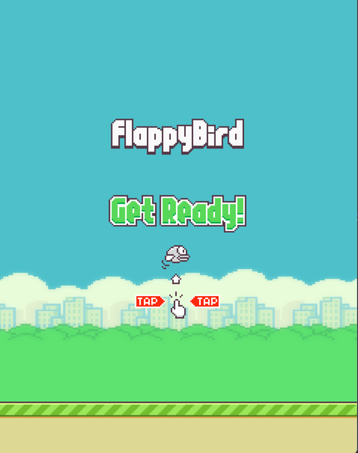
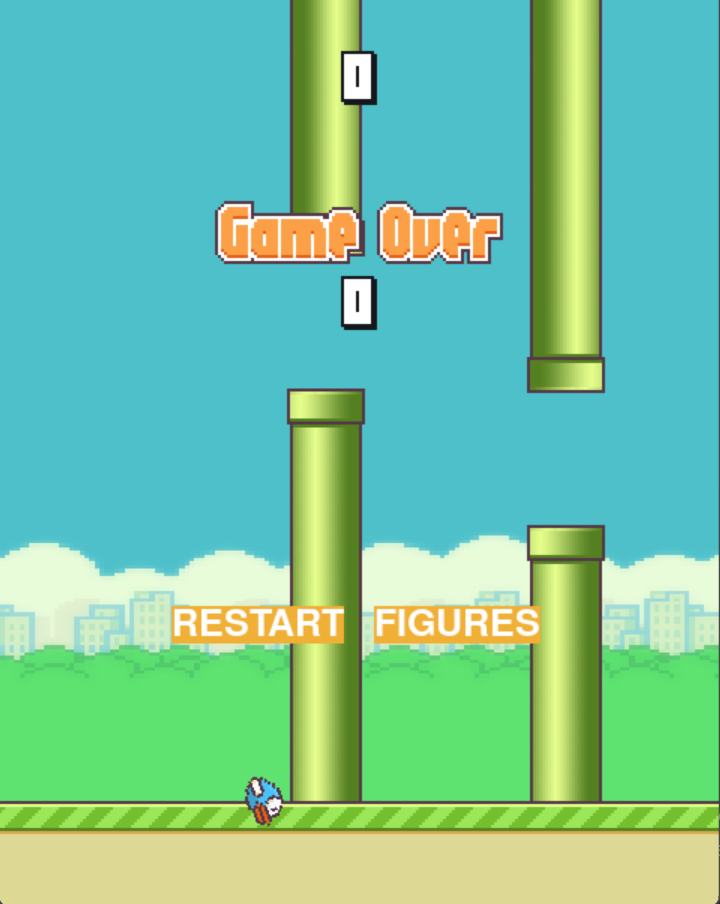

# Käyttöohje

Projektin viimeisimmän *Github Releasen* voi ladata [täältä](https://github.com/LerkkaP/otharjoitustyo/releases/tag/viikko5)

## Ohjelman käynnistys

Suorita seuraava komento asentaaksesi tarvittavat riippuvuudet

```bash
poetry install
```

Käynnistä sovellus komennolla:

```bash
poetry run invoke start
```

## Pelaaminen




Ruudulle avautuu aloitustilanne. Näytöllä on kuva, joka kehottaa valmistautumaan peliin. Pelin voi aloittaa painamalla **space** näppäintä tai **vasenta** hiirinäppäintä. Kun peli alkaa, tavoitteena on lentää mahdollisimman pitkälle putkien välistä. Pelaaja näkee reaaliaikaisesti pistemäärän päivittyvän, kun putkien välistä lentää. Mikäli lintu törmää putkiin tai putoaa maahan, peli päättyy ja näytetään saatu tulos ja paras tulos. Pelin voi aloittaa alusta viemälle hiiren kursorin tekstin **restart** päälle ja painamalla sitä. 



## Huomio

Loppunäytön tekeminen on kesken, joten painike **figure** ei vielä toimi. Lisäksi saadun tuloksen ja kaikkien aikojen parhaan tuloksen sijoittelua näytöllä täytyy parantaa.
