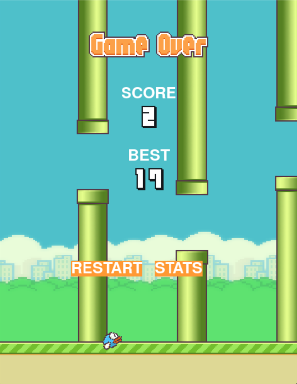

# Käyttöohje

Projektin viimeisimmän *Github Releasen* voi ladata [täältä](https://github.com/LerkkaP/otharjoitustyo/releases/tag/viikko5)

## Ohjelman käynnistys

Suorita seuraava komento asentaaksesi tarvittavat riippuvuudet

```bash
poetry install
```

Käynnistä sovellus komennolla:

```bash
poetry run invoke start
```

## Pelaaminen


Pelin aloitustilanteessa ruudulle avautuu kuva, joka kutsuu käyttäjää valmistautumaan peliin. Pelaaja voi käynnistää pelin painamalla __space__-näppäintä tai klikkaamalla __vasenta__ hiiren näppäintä. Kun peli käynnistyy, tavoitteena on lentää mahdollisimman pitkälle putkien välissä. Pelaaja näkee reaaliajassa pistemääränsä päivittyvän lentäessään putkien välistä. Jos lintu törmää putkeen tai putoaa maahan, peli päättyy. Tällöin näytetään saavutettu tulos sekä paras tulos. Pelaaja voi aloittaa pelin alusta viemällä hiiren kursorin painikkeen __RESTART__ päälle ja klikkaamalla sitä.



Vaihtoehtoisesti pelaaja voi tarkastella, miten hänen pisteensä ovat kehittyneet pelikertojen edetessä.
Tämä onnistuu painamalla painiketta __STATS__, josta avautuu näkymä kuvaajaan. __BACK__ painiketta klikkaamalla pelaaja pääsee takaisin lopetusnäyttöön. HUOM! Pelisessioiden indeksointi kuvaajassa alkaa nollasta, joten ensimmäistä pelisessiota vastaa x-akselilla piste 0. Lisäksi on tärkeää huomata, että kuvaajassa ei esiinny viivaa, mikäli pelikertoja ei ole kertynyt tarpeeksi.


