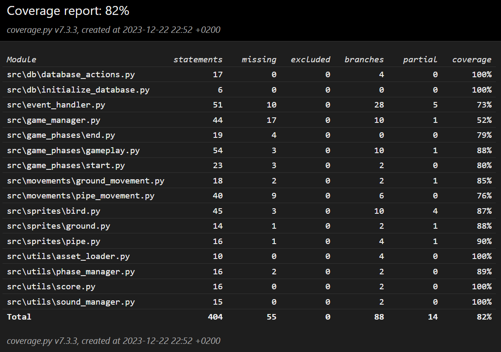

# Testausdokumentti

## Yksikkö- ja integraatiotestaus

Kaikkia luokkia on pyritty testaamaan, joko __suoraan__ tai __välillisesti__. Metodikutsujen testauksessa on erityisesti hyödynnetty __Unittestin__ mukana tulevaa luokkaa `MagicMock`

## Testauskattavuus

Testien haarautumakattavuus on 82%.

`GameManager`-luokan testaamisessa on esiintynyt ongelmia, joten sen haarautumakattavuus on vain __52%__. `Stats`-luokka on jätetty testauksen ulkopuolelle, koska se keskittyy pääasiassa graafiseen käyttöliittymään.