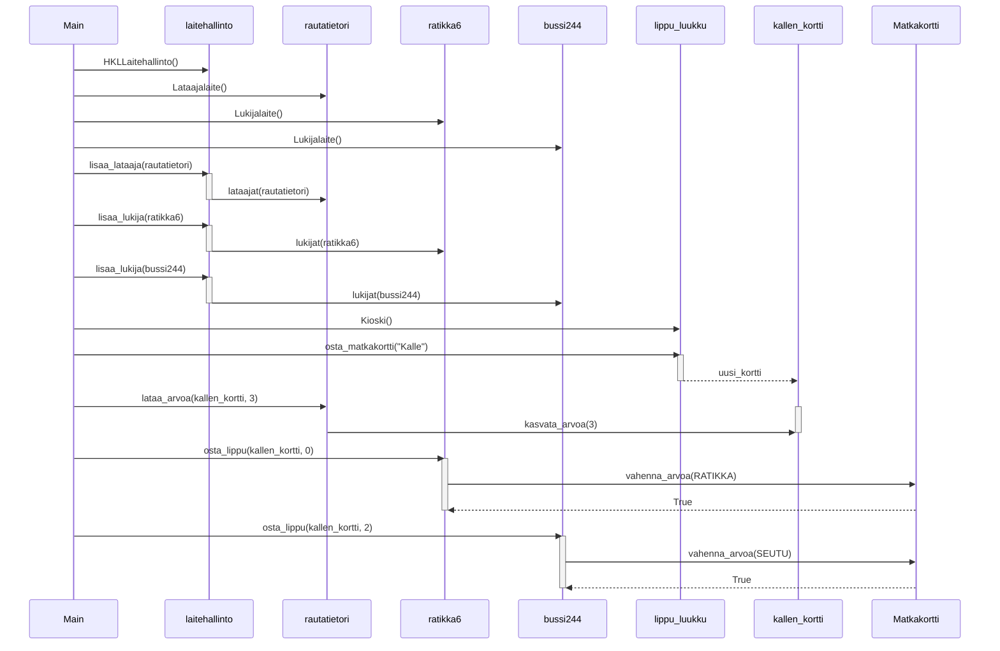

```mermaid
sequenceDiagram
    Main->>laitehallinto: HKLLaitehallinto()

    Main->>rautatietori: Lataajalaite()
    Main->>ratikka6: Lukijalaite()
    Main->>bussi244: Lukijalaite()

    Main->>laitehallinto: lisaa_lataaja(rautatietori)
    activate laitehallinto
    laitehallinto->>rautatietori: lataajat(rautatietori)
    deactivate laitehallinto

    Main->>laitehallinto: lisaa_lukija(ratikka6)
    activate laitehallinto
    laitehallinto->>ratikka6: lukijat(ratikka6)
    deactivate laitehallinto

    Main->>laitehallinto: lisaa_lukija(bussi244)
    activate laitehallinto
    laitehallinto->>bussi244: lukijat(bussi244)
    deactivate laitehallinto

    Main->>lippu_luukku: Kioski()
    Main->>lippu_luukku: osta_matkakortti("Kalle")
    activate lippu_luukku
    lippu_luukku-->>kallen_kortti: uusi_kortti
    deactivate lippu_luukku

    Main->>rautatietori: lataa_arvoa(kallen_kortti, 3)
    activate kallen_kortti
    rautatietori->>kallen_kortti: kasvata_arvoa(3)
    deactivate kallen_kortti

    Main->>ratikka6: osta_lippu(kallen_kortti, 0)
    activate ratikka6
    ratikka6->>Matkakortti: vahenna_arvoa(RATIKKA)
    Matkakortti-->>ratikka6: True
    deactivate ratikka6

    Main->>bussi244: osta_lippu(kallen_kortti, 2)
    activate bussi244
    bussi244->>Matkakortti: vahenna_arvoa(SEUTU)
    Matkakortti-->>bussi244: True
    deactivate bussi244

```
