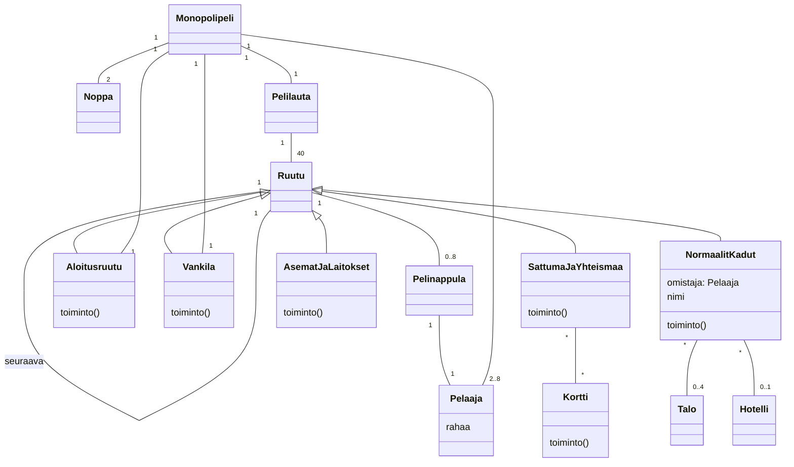

## Monopoli, alustava luokkakaavio

```mermaid
classDiagram
    Monopolipeli "1" -- "2" Noppa
    Monopolipeli "1" -- "1" Pelilauta
    Pelilauta "1" -- "40" Ruutu
    Ruutu "1" -- "1" Ruutu : seuraava
    Ruutu "1" -- "0..8" Pelinappula
    Pelinappula "1" -- "1" Pelaaja
    Pelaaja "2..8" -- "1" Monopolipeli
    Ruutu <|-- Aloitusruutu
    Ruutu <|-- Vankila
    Ruutu <|-- SattumaJaYhteismaa
    Ruutu <|-- AsematJaLaitokset
    Ruutu <|-- NormaalitKadut
    Monopolipeli "1" -- "1" Aloitusruutu
    Monopolipeli "1" -- "1" Vankila
    SattumaJaYhteismaa "*" -- "*" Kortti
    NormaalitKadut "*" -- "0..4" Talo
    NormaalitKadut "*" -- "0..1" Hotelli

    class Aloitusruutu {
        toiminto()
    }

    class Vankila {
        toiminto()
    }

    class SattumaJaYhteismaa {
        toiminto()
    }

    class AsematJaLaitokset {
        toiminto()
    }

    class NormaalitKadut {
        omistaja: Pelaaja
        nimi
        toiminto()
    }

    class Kortti {
        toiminto()
    }

    class Pelaaja {
        rahaa
    }

```
